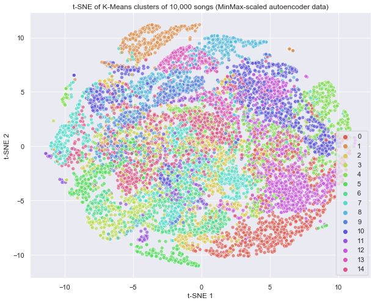
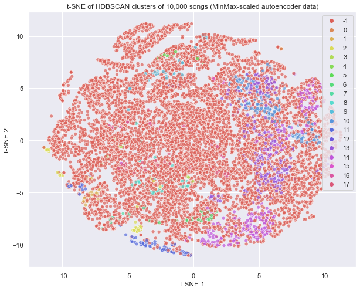
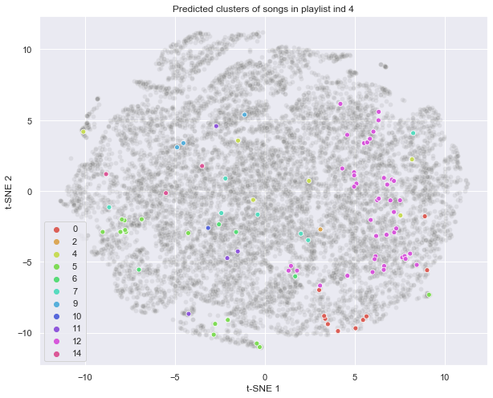

## Welcome to the Digital Frontier 

<a href="https://wfseaton.github.io/TheDigitalFrontier/">Home Page</a> - 
<a href="https://wfseaton.github.io/TheDigitalFrontier/data_preparation">Data Preparation</a> - 
<a href="https://wfseaton.github.io/TheDigitalFrontier/data_exploration">Data Exploration</a> - 
<a href="https://wfseaton.github.io/TheDigitalFrontier/dimensionality_reduction">Dimensionality Reduction</a> - 
<a href="https://wfseaton.github.io/TheDigitalFrontier/clustering_techniques"><b>Clustering Techniques</b></a> - 
<a href="https://wfseaton.github.io/TheDigitalFrontier/playlist_generation">Playlist Generation</a> - 
<a href="https://wfseaton.github.io/TheDigitalFrontier/conclusion">Conclusion</a> - 
<a href="https://wfseaton.github.io/TheDigitalFrontier/authors_gift">Authors' Gift</a>

-------------------------------------------------------------------------------------------------------------------

# Identifying Clusters of Songs

Our belief in generating playlists is that each playlist should have a theme, which we thought would be best represented by clustering songs. With these clusters, we could assume that songs are similar along some dimensions identified by the unsupervised machine learning algorithm and would go well together on a single playlist. We explored several methods of clustering to find groups of songs that belong together based on their characteristics such as tempo, valence, etc.

# t-SNE Visual Representation

We used the technique t-Distributed Stochastic Neighbor Embedding (t-SNE) to visualize our high-dimension data in the 2-D space. We show below the t-SNE representations of the data output from the autoencoder we trained for clustering.

t-SNE maps each datapoint in the higher dimension input dataset to a lower dimension space (typically 2-D or 3-D) for the purposes of visualization. The mapping is created in a way such that nearby points in the lower dimension space correspond to "similar" datapoints in the original space and distant points correspond to "dissimilar" datapoints. The lower dimension representation can then be consumed similar to other standard visualizations such as scatterplots.

t-SNE applies dimension reductionality probabilistically, in comparison to Principal Component Analysis (PCA) which applies a mathematical function to calculate the direction of minimum error. t-SNE is a computationally intensive technique because it looks at data distributions and attempts to calculate similar representations with fewer dimensions for each dimension. 

We use t-SNE only for visualization here. The downside is that interpretability becomes slightly harder as t-SNE will represent a reduced 2-D cluster that is different than the *N*-Dimensions that our clustering algorithms are actually using to identify song types.

What does data look like in a 2-D t-SNE space? We plotted a random selection of four playlists (colored dots) into the t-SNE space to demonstrate how the data behaves through this representation. If we assume that playlists are already thematically grouped and includes similar songs, our resulting t-SNE chart is a big surprise. It appears that at least at two dimensions, a single playlist is nearly randomly dispersed across the t-SNE space. We'll need to apply better multi-dimensional clustering to improve resulting plots.

# K-Means Clustering

K-Means was our initial clustering model, serving as our baseline playlist generation algorithm and as a core input into our final playlist algorithm. Our baseline playlist generation algorithm consisted of basic K-Means clustering, whereby we clustered songs by the properties available after our initial cleaning and transformation process. A user could then provide a handful of songs to cold start the playlist, after which we'd select future songs from the same cluster as the provided songs until our playlist was full.

K-Means works by identifying the closest cluster center (called the centroid) for every data point and labels that data point as a member of that cluster. It optimizes the identified clusters by minimizing the cluster's sum of squares (Euclidean distance) around the centroid so that each cluster will be as narrow and focused as possible. Since K-Means uses the sum of squares to identify clusters, we need to be careful with higher dimension data since different scales for each variable can lead to the distances to blow up.

K-Means requires the manual specification of a target number of clusters, which we selected to be 15 for our final model. This presented an initial challenge as we became familiar with our data, not knowing how many clusters was a reasonable target, but through parameter tuning we were able to choose a selection that represented sufficient separation. 

For our final model, we take the 5 variables resulting from the autoencoder dimension reduction technique to identify 15 clusters using K-Means.

We list here the number of songs belonging to each cluster.

    0 : 17434
    1 : 7447
    2 : 16620
    3 : 10878
    4 : 17170
    5 : 10155
    6 : 12500
    7 : 20787
    8 : 12098
    9 : 11318
    10 : 21551
    11 : 5942
    12 : 20485
    13 : 8673
    14 : 20617

## K-Means Assessment

K-Means provides us with the provided number of clusters but few of these appear to maintain any sort of distance separation from other clusters, suggesting that they may be more intertwined than we'd like. For playlist generation, we can leverage K-Means and the assumption that even if these songs are extremely distinct, they are still the *most* similar songs. This assumption works for song selection because even if most songs are similar across genres, a pop song will still be more similar to another pop song than it will be to a death metal song.

# HDBSCAN Clustering

HDBSCAN is a library of software tools that implements a clustering algorithm developed by [Campello, Moulavi, and Sander](http://link.springer.com/chapter/10.1007%2F978-3-642-37456-2_14). It is a powerful step above K-Means in that it does not require you to specify the number of clusters, but instead analyzes density distribution, assumes a certain level of noise, and returns only clusters of data that reach a certain threshold of density. Given the diversity of song styles, our hypothesis was that there would be a large number of "noise" songs, songs that don't fit into an identifiable category and that are best ignored when generating a playlist with a desired theme. What should remain after HDBSCAN are clusters of songs that are similar enough to have an enjoyable thematic experience in our new playlist.

To better understand the HDBSCAN algorithm, let's explore its process step-by-step. First, HDBSCAN estimates density using distance to *k*th nearest neighbors, referred to in the literature as *core distance*. A second distance metric, referred to as *mutual reachability distance*, is calculated that spreads sparse points farther away while leaving denser points relatively untouched.

    Number of clusters: 18

### HDBSCAN Assessment

In contrast to the generated K-Means clusters, we immediately see that HDBSCAN produces very different results thanks to its inclusion of the concept of noise. Any song marked as belonging to cluster *-1* is classified as noise and the vast majority of songs are classified into this cluster by HDBSCAN.

The library does identify five major song clusters (those that are colored pink, purple, blue, teal and yellow). This suggests that there are certain types of songs that are highly similar in their melody, tempo or other song attributes but that on the whole, there is not enough density to group most songs into a confident cluster. This presents challenges for our playlist generation algorithm, as our hypothesis rests on songs being similar enough to allow like selection.

# Clustering Conclusion

After trying to cluster songs via K-Means and HDBSCAN, we're left with the feeling that based on the song attributes we have collected, it is challenging to identify distinct patterns of song in an absolute sense. 

HDBSCAN was able to identify a handle of small but dense clusters that we can have confidence are similar to each other but the majority of songs across genres are similar enough as to be undifferentiable. For playlist generation, we can still rely on relative differentiation to identify the next song selection.

To assess whether our methods were effective, we chose to plot a single playlist after clustering. We considered HDBSCAN first but due to the high proportion of songs classified as "noise" in cluster *-1*. HDBSCAN is essentially telling us that most songs (as characterized by the reduced dimensions) are similar to each other and it cannot find meaningful seperation amongst them.

As such, we saw better results after our K-Means clustering. We picked K-Means because our playlist generation algorithm, the way we defined it, relies on every song being in a cluster. We would rather have larger, more generalised (but also noisy / wrong) clusters in order to have something with which to pull “similar” songs, even if that clustering is a stretch (per what HDBSCAN showed us).

In assessing the above sample single playlist, we see that t-SNE represents the geographic distribution as being fairly random, with a potential overall skew towards the bottom right of the graph. But in applying the K-Means cluster label as a color code, we see that for this playlist, half of the songs are in a single cluster 12 with another fifth in each of clusters 7, 5 and 0. This appears much more promising for playlist generation! K-Means has found a relative connection between songs presumed to be similar (since they belong to the same playlist in our original dataset).
