## Generating a Spotify Playlist

<a href="https://wfseaton.github.io/TheDigitalFrontier/">Home Page</a> - 
<a href="https://wfseaton.github.io/TheDigitalFrontier/data_preparation.html">Data Preparation</a> - 
<a href="https://wfseaton.github.io/TheDigitalFrontier/data_exploration.html"><b>Data Exploration</b></a> - 
<a href="https://wfseaton.github.io/TheDigitalFrontier/dimensionality_reduction.html">Dimensionality Reduction</a> - 
<a href="https://wfseaton.github.io/TheDigitalFrontier/clustering_techniques.html">Clustering Techniques</a> - 
<a href="https://wfseaton.github.io/TheDigitalFrontier/playlist_generation.html">Playlist Generation</a> - 
<a href="https://wfseaton.github.io/TheDigitalFrontier/conclusion.html">Conclusion</a> - 
<a href="https://wfseaton.github.io/TheDigitalFrontier/authors_gift.html">Authors' Gift</a>

-------------------------------------------------------------------------------------------------------------------

# Explore Spotify's Song Data and Musical Features

Our enriched master tables provides us with fertile ground for exploratory data analysis as we seek to understand the playlist groupings and song features for all songs in the provided dataset. We start with 25 song features of interest.

    1. artist_name
    2. artist_uri
    3. track_name
    4. album_uri
    5. duration_ms
    6. album_name
    7. count
    8. track_uri
    9. danceability
    10. energy
    11. key
    12. loudness
    13. mode
    14. speechiness
    15. acousticness
    16. instrumentalness
    17. liveness
    18. valence
    19. tempo
    20. time_signature
    21. artist_genres
    22. artist_popularity
    23. album_genres
    24. album_popularity
    25. album_release_date

### Playlist Distributions

We begin by seeking to understand how many songs appear in each playlist as well as how many playlists each song appears in. There is a very strong right skew for song distribution, as a few songs appear in an enormously large number of playlists while the vast majority of songs appear in very few playlists overall. Because of this, we have filtered out songs that appear only once, or in more than 50 playlists, to present a more readable distribution.

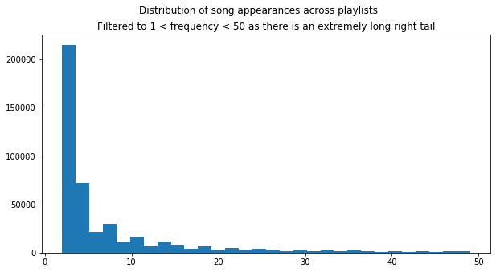

The median number of songs in a playlist is about 20, though this too has a long right tail. The maximum number of songs in a single playlist in our dataset is 341.

    Largest playlist 341
    Smallest playlist:  3

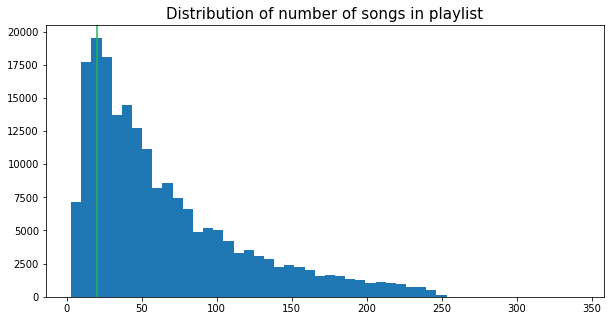

For our newly enriched musical features, we leverage Seaborn distribution plots to understand the nature of each of these columns. Some have a relatively even distribution but even more appear to be centered around a small value. Song duration centers expectedly around 3-4 minutes, though there are a few songs with extremely long lengths. These are presumed to be songs in playlists related to sleep, where frequent switching is detrimental to a relaxing environment. Danceability, a critical feature in these author's opinions, centers around a score of 0.6 but energy has a left skew with a center around 0.8-0.9. Liveness, instrumentalness, speechiness and loudness all have fairly centered values with a few songs exhibiting different behaviors. The overall gathering of song features around a few feature values is an interesting takeaway.

    The distribution plots below map to these columns:
    
    --------------------------------------------------
    duration_ms | count             | danceability
    --------------------------------------------------
    energy      | tempo             | loudness
    --------------------------------------------------
    speechiness | acousticness      | instrumentalness
    --------------------------------------------------
    liveness    | artist_popularity | album_popularity
    --------------------------------------------------
    

    Time elapsed: 3.9 seconds

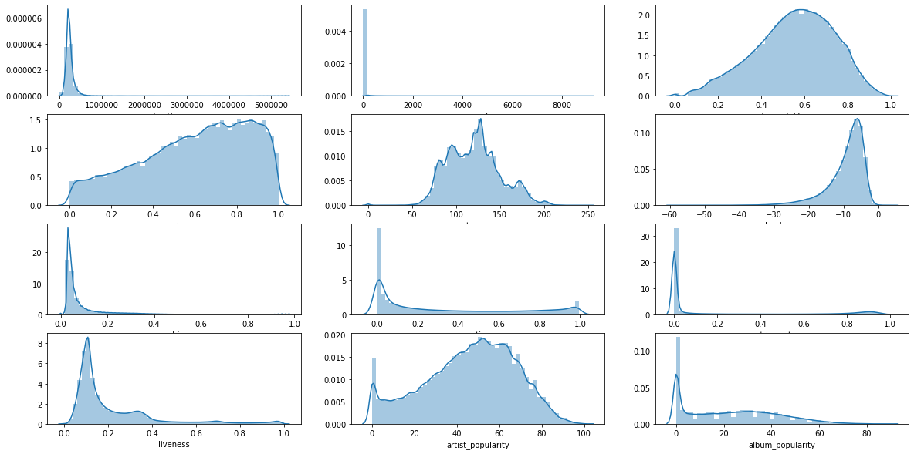

## Pairwise Associations

We next explore whether any features exhibit correlations between each other. We do this to get an early sense on if relationships exist that a model could learn or if any model we apply would struggle with randomness. The majority of features do appear to be randomly related, with data distributions materializing as complete squares on the pairplot graphs. There are some potential relationships that show promise, which we continued to explore in detail.

    Time elapsed: 275.631 seconds

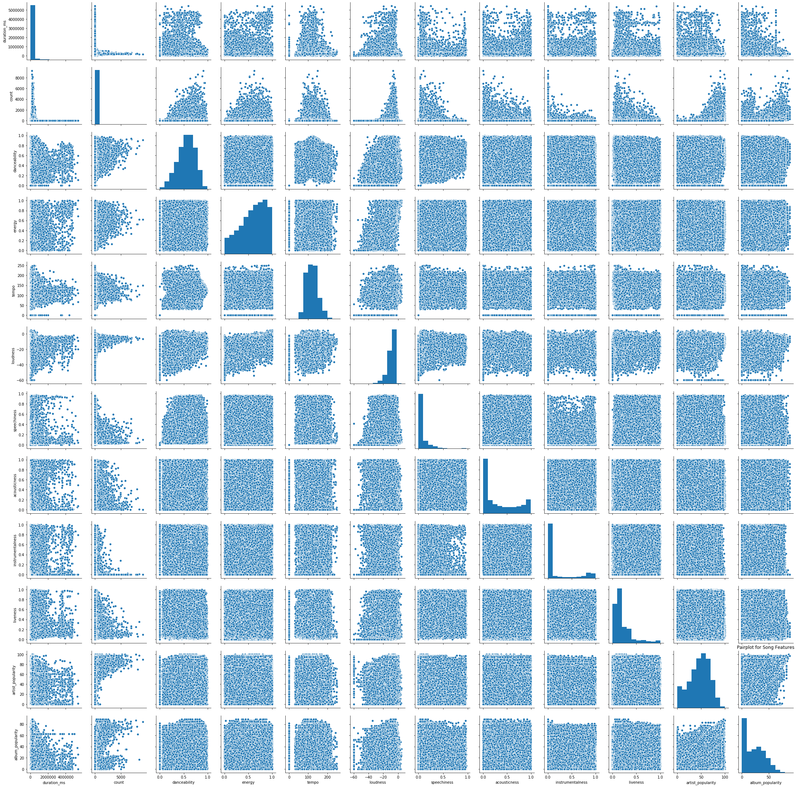

`Energy` and `loudness` have the most visually linear relationship, where, as `energy` increases, so too does `loudness`. We have affectionately labeled this the "*Haley's Comet of Music*".

    Time elapsed: 561.528 seconds

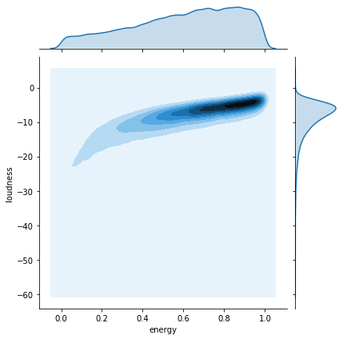

`Tempo` and `danceability`, two features that have the most normal distributions, appear to mirror each other as well, with peaks at a `tempo` of 125 and a `danceability` range between 0.6 and 0.8.

    Time elapsed: 817.11 seconds

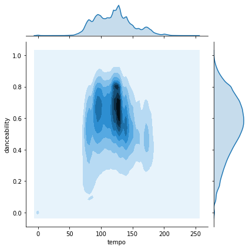

Charting that same relationship between `tempo` and `danceability` on a scatterplot highlights that peak concentration even better. The "*Tempo Bump*" occurs at about 125 beats-per-minute (bpms) with a clear jump in `danceability`.

    Time elapsed: 2.337 seconds

## Are certain song features associated with playlist inclusion?

We next turned to whether song features had any relationship to playlist inclusion. Are certain features more predictive of the number of playlists they are likely to be included in?

We started with `danceability` and see the hint of a linear relationship, where as `danceability` increases so too does the number of playlists it will be included in. There remains a lot of song noise though, taken from the songs that we saw in our inclusion distributions earlier as just not being popular and added to only a few playlists.

    Time elapsed: 1.953 seconds

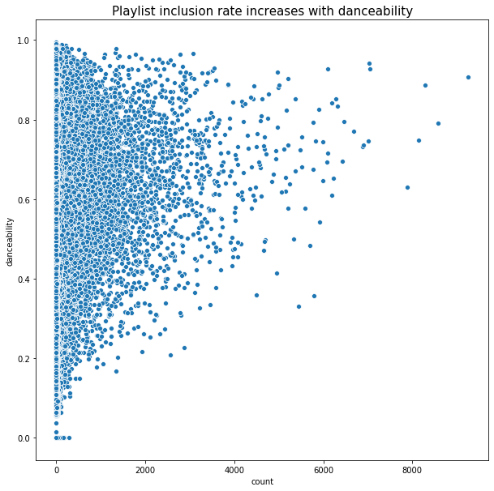

`Loudness` has a clear spike at about -8 but with fairly rigid hard limits above and below that. All songs softer than -20 are included in very few playlists. The same holds true for songs louder than ~0.

    Time elapsed: 1.95 seconds

`Energy` appears to have very little impact on playlist inclusion, with songs at every level of energy included at high amounts. Playlists vary across their desired theme, from slower classical music to upbeat electronic, so this mirrors our expectations.

    Time elapsed: 1.973 seconds

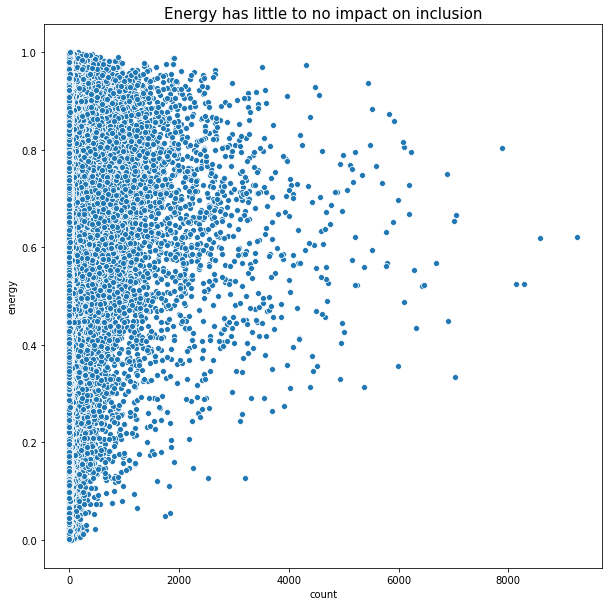

There exists the expected relationship between `artist_popularity` as calculated by Spotify and the number of playlists those songs are included in.

    Time elapsed: 1.954 seconds

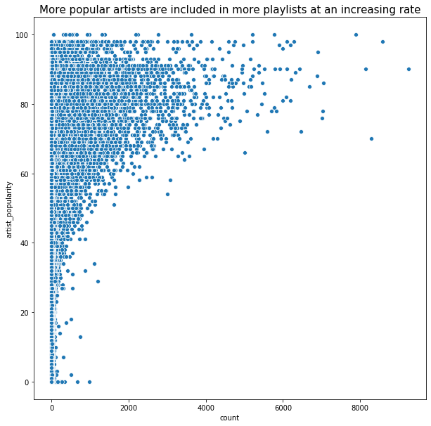

That expected linear relationship does not hold for `album_popularity` though. Instead, there is a clear delineation of playlist inclusion for both very popular albums and very unpopular albums. We posit that this is due to the phenomenon of one-hit wonders, whereby an album might be panned by critics and music fans overall but it was listened to and reviewed because it had one or two very popular songs. Those individual songs will be included in playlists, thanks to the flexibility of streaming services, even though the album overall remains unpopular. It is the middle range of albums, with no hit songs and an average rating, that are most at risk of not being included in playlists.

    Time elapsed: 5.503 seconds

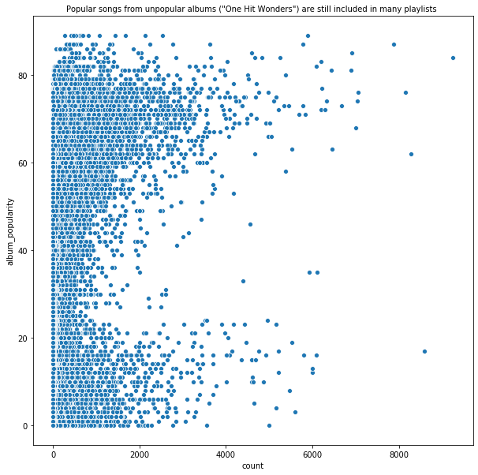

Song duration (`duration_ms`), similar to loudness, has a very narrow band of lengths that users consider acceptable for playlist inclusion. This length is about 3.5 minutes, with songs longer than ~4 minutes appearing in an extremely low number of playlists.

    Time elapsed: 1.935 seconds

The final continuous musical feature we explored was `tempo`. Our hypothesis was that there would exist several popular tempoes for different genres of songs, something we saw hinted at in our analysis of `energy`, so we expanded 'tempo' into a more detailed histogram. Our hypothesis proved true, with peaks occuring at 80, 100, 120, 128, 139 and 170, which we believe map to different genres of music.

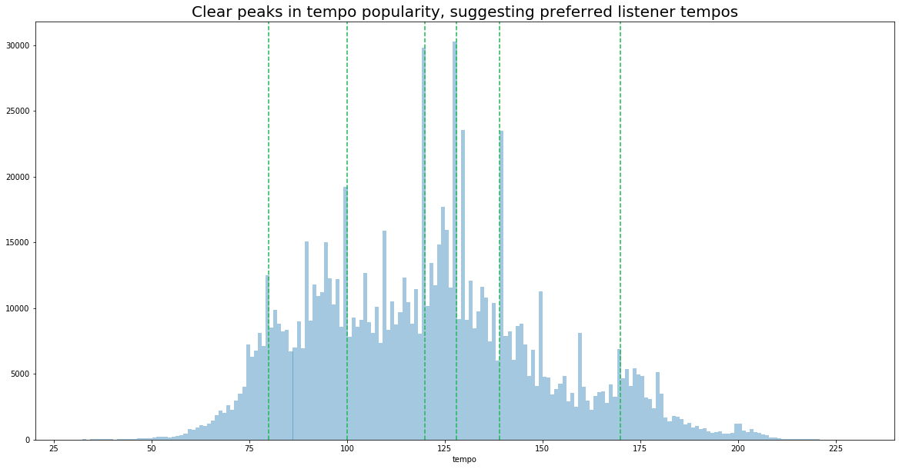

## How have song features changed over time?

Moving on from exploring feature relationships, we next explored how these features have been changing over time for songs released in different years. We derived a new `release_year` column from the `album_release_date` column. We filter to all songs released between 1950 and 2017 to ensure sufficient data for our chart and show the distribution of release years currently in Spotify's library below.

    Time elapsed: 0.411 seconds

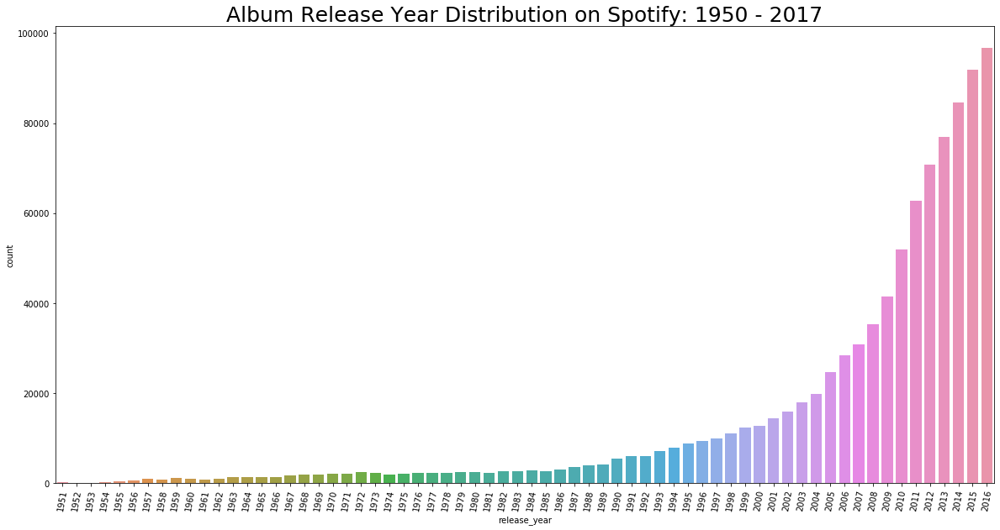

Varying features occur at different scales so we use `MinMaxScaler` from `sklearn` to scale them all between 0 and 1 and chart the changes on a single plot. The most dramatic cross over occurs with `acousticness` and `energy`, as the former declines severely starting in the 1950s and the latter rises steadily over time. The trend reverses itself temporarily during the 1980s but diverges again at a slower pace from 1990 to today. `Valence`, Spotify’s measure of positivity in a song, has also been declining at a slow but steady pace since about 1977.

    Time elapsed: 119.136 seconds

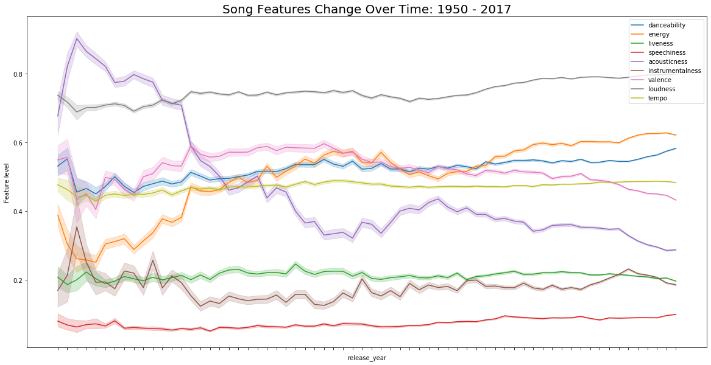

`Loudness` has been reaching record heights beginning in the 1990s. This may be associated with the spike in popularity that decade of electronic music due to the proliferation of cheap music production technology.

    Time elapsed: 17.608 seconds

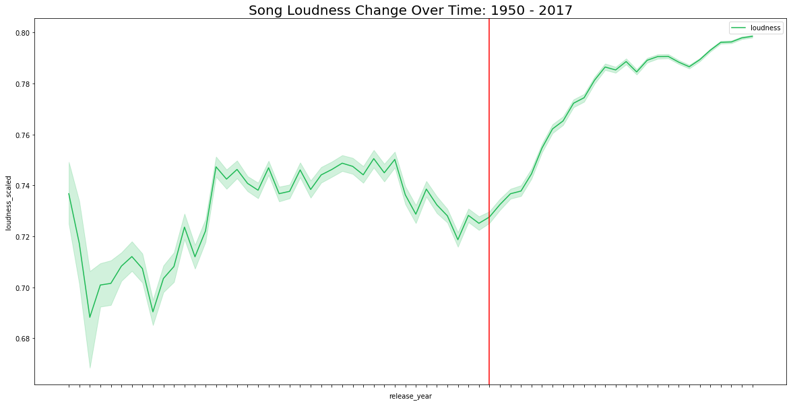

The most recent trend occurs with `danceability`, spiking to its highest ever levels starting in 2010.

    Time elapsed: 17.19 seconds

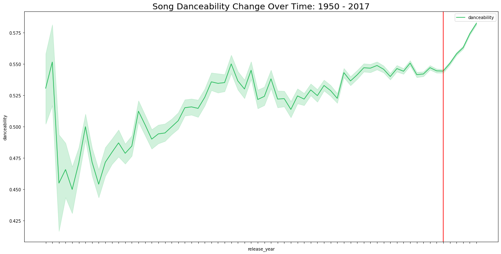

Lastly, we wanted to explore popular musical keys for songs as well as a sample of popular genres. If you filter to the Top 100 most included songs, there are clear preferences in song key at First Key (C♯/D♭) and Seventh Key (G, or sol). For playlists, *sleep* is actually a surprisingly popular genre, likely related to the number of extremely long songs. Unfortunately, beyond that, Spotify's structuring of genre makes analysis difficult. They include many specific genres for each album without specifying whether there is a primary genre. This means that there are potentially more popular genres than sleep, but in a simple histogram analysis, they will be reduced in frequency due to the varying nature of genre inclusions.

    999950 100
    Time elapsed: 0.528 seconds

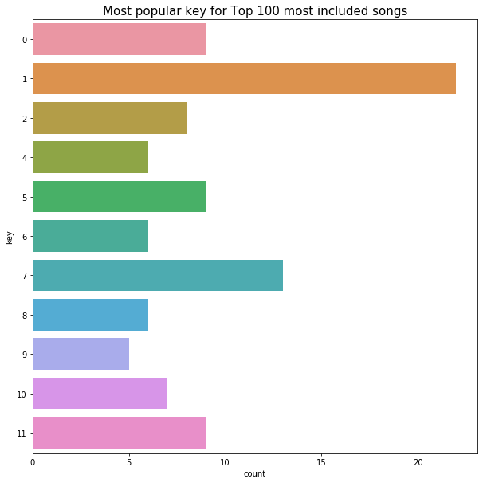

#### What did our exploration teach us?

There exist relationships among song features and between features and playlist inclusion that suggest a modeling approach would have something by which it could identify popular and similar songs. There are enough distinctions in musical features like `tempo` or `danceability` to suggest distinct types of songs. The majority of features appear unrelated to each other, with no visually discernible relationships and partially because of that, we wanted to apply techniques to reduce the number of dimensions used to the important ones.
